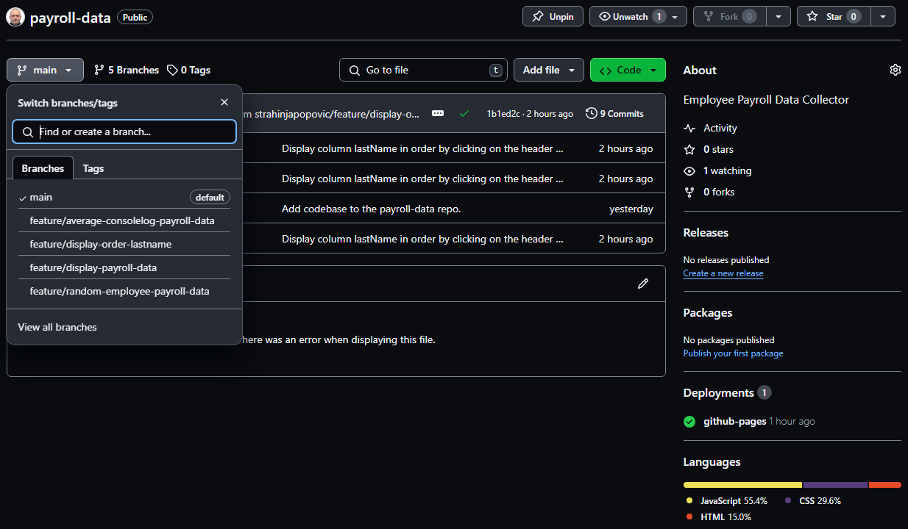

# Payroll Data Table

## Description

Employee payroll data table combine `HTML`, `CSS` and `JS` basic capabilities and demonstrate fundamental rendering and functionality.

## Usage

New repository created at GitHub account strahinjapopovic as payroll-data.

[](./README-screenshots/github-payroll-data.PNG)

Project has been pushed from the local storage to GitHub with codebase and new **branch** was created as **(feature/display-payroll-data)**.

[](./README-screenshots/display-collect-payroll-data.PNG)

*Contiinuing ...*

[](./README-screenshots/display-collect-payroll-data-feature-branch.PNG)

Marge the ***(main)*** branch with ***(feature/display-payroll-data)*** feature branch as follows.

[](./README-screenshots/marge-main-display-payroll-data.PNG)

*Continuing ...*

[](./README-screenshots/marge-main-display-payroll-data-2.PNG)

New feature branch has been created **(feature/average-consolelog-payroll-data)**.

[](./README-screenshots/average-consolelog-payroll-data.PNG)

Marge the ***(main)*** branch with ***(feature/average-consolelog-payroll-data)*** feature branch as follows.

[](./README-screenshots/marge-main-random-employee.PNG)

New feature branch has been created **(feature/random-employee-payroll-data)**.

[](./README-screenshots/random-employee-payroll-data.PNG)

Marge the ***(main)*** branch with ***(feature/random-employee-payroll-data)*** feature branch as follows.

[](./README-screenshots/marge-main-random-employee.PNG)

New feature branch has been created **(feature/display-order-lastname)**.

[](./README-screenshots/ordered-lastname-payroll-data.PNG)

Marge the ***(main)*** branch with ***(feature/display-order-lastname)*** feature branch as follows.

[](./README-screenshots/marge-main-order-lastname.PNG)

### *All Branches*

[](./README-screenshots/payroll-data-branches.PNG)

### *Application has been deployed on a live server with a following results:*

*Inserted values through the prompts in the while loop are:*
```javascript

const employee_array = [
    {
        firstName: "John", 
        lastName: "Doe", 
        salary: 89600
        },

    {
        firstName: "Michael", 
        lastName: "Smith", 
        salary: 78500
        },

    {
        firstName: "David", 
        lastName: "Green", 
        salary: 68700
        },

    {
        firstName: "Victor", 
        lastName: "Smolin", 
        salary: 88560
        }
];

console.log(employee_array);

let data;
let avg = 0;
let total = 0;
const employeesArray = [];
//****************************************************************************************************************//
// Collect employee data
const collectEmployees = function () {
  // Get user input to create and return an array of employee objects
  //****************************************************************************************************************//
  while (confirm("Do you want to add another employee data.") == true) {
    data = {};
    data.firstName = prompt("Enter employee first name:");
    data.lastName = prompt("Enter employee last name.");
    data.salary = parseFloat(prompt("Enter employee salary:"));
    if (isNaN(data.salary) || data.salary == null) {
      data["salary"] = 0;
    }
    //employeesArray.push(data);
    employeesArray[employeesArray.length] = data;
    console.log(`Salary-${employeesArray.length} : ${employeesArray[employeesArray.length - 1].salary} \n`);
  }
  console.log("===");
  console.log(`Number of objects in array : ${employeesArray.length}`);
  console.log("===");
  console.log(employeesArray);
  console.log("===");
  //****************************************************************************************************************//
  for (let i = 0; i < employeesArray.length; i++) {
    total += Math.floor(parseFloat(employeesArray[i].salary));
  }
  avg = Math.floor(parseFloat(total / employeesArray.length));
  console.log(`The average employee salary between our ${employeesArray.length} employee(s) is $ ${parseFloat(avg)}.00`);
  //****************************************************************************************************************//
  console.log("===");
  //****************************************************************************************************************//
  const rand = Math.floor(Math.random() * 3);
  let randomEmployee = employeesArray[rand];
  console.log(`Congratulations to ${randomEmployee.firstName} ${randomEmployee.lastName}, our random drawing winner! `);
  //****************************************************************************************************************//
  console.log("===");
  //****************************************************************************************************************//
  return;
}

```
- Ordering Ascending or Descending Last or First Name in the table is available if you click on the table header First Name and Last Name column.

[](./README-screenshots/payroll-data-online-presentation.PNG)

Repository over GitHub account you can find [GitHub Repos][1] and application deployment at [GitHub Pages][2].

[1]: https://github.com/strahinjapopovic/payroll-data            "GitHub Repos"
[2]: https://strahinjapopovic.github.io/payroll-data/            "GitHub Pages"

## License

Please refer to the MIT LICENSE in the repo.
